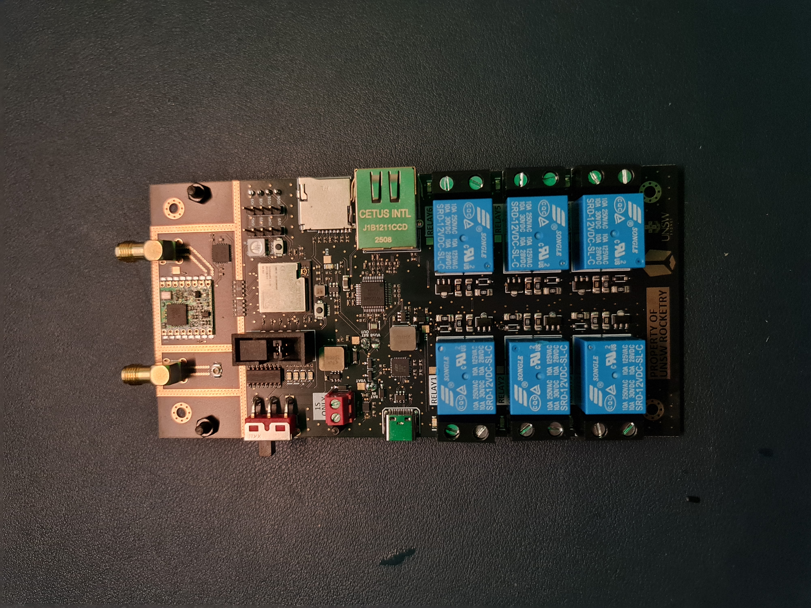
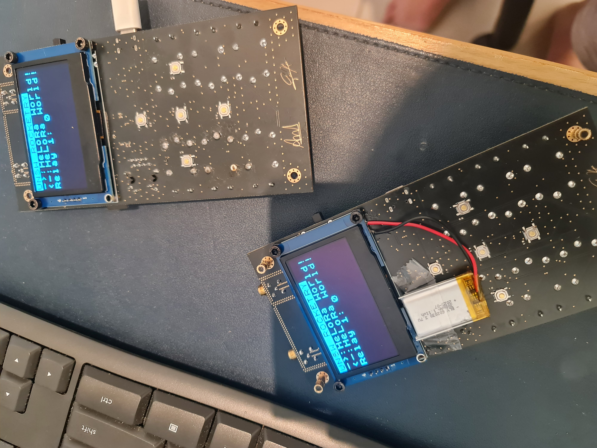

# Wireless Control System

## Overview
This project was tasked by UNSW rocketry's propulsions sub-team to design a wireless module which is used to launch a two stage rocket over a 800m distance and retrieve sensor data.

The module is powered by an ESP32-S3-MINI-U1 which features a dual core processor, where each processor can be used for a dedicated function. For wireless communication, it is done over LoRa. An off-the-shelf module is utilized in this design. Other features includes an OLED display for viewing information, battery charging system to make the device modular, relays for high voltage/current control, and ethernet for high bandwidth wired communication.

## Known issues
- The wireless charging IC needs two pull up resistors on the battery status indicator pins to correctly display battery state. The pins are open drain which is mentioned in the datasheet but I didn't realize I needed them. Update your schematics accordingly.
- The zener diode implemented on the relay-controls schematic has a breakdown voltage of 4.7V while the anode voltage is 12V and the cathode is about 0V. This caused the supply voltage to constantly be clamped to 4.7V which hinders the functionality of the relays. Remove the zener diode or use a diode with a higher breakdown voltage in your design.

## Notes
- Relays utilized can be connected to mains voltage for high power control. See BOM for part number and search the datasheet for more details on the part.
- The design includes male breakout headers pins for unused pin connections on the ESP32, you can connect external devices to these pins for control. The header pins also include an I2C bus.
- The code is written such that the data is transmitted without checking whether or not it has successfully been received on the other end. The transport layer needs to be improved to ensure reliable communication. Here are some recommended transport layer protocols:
  - Stop-And-Wait:     low throughput, low memory
  - Go-Back-N:         High throughput, low memory
  - Selective-Repeat:  High throughput, high memory
